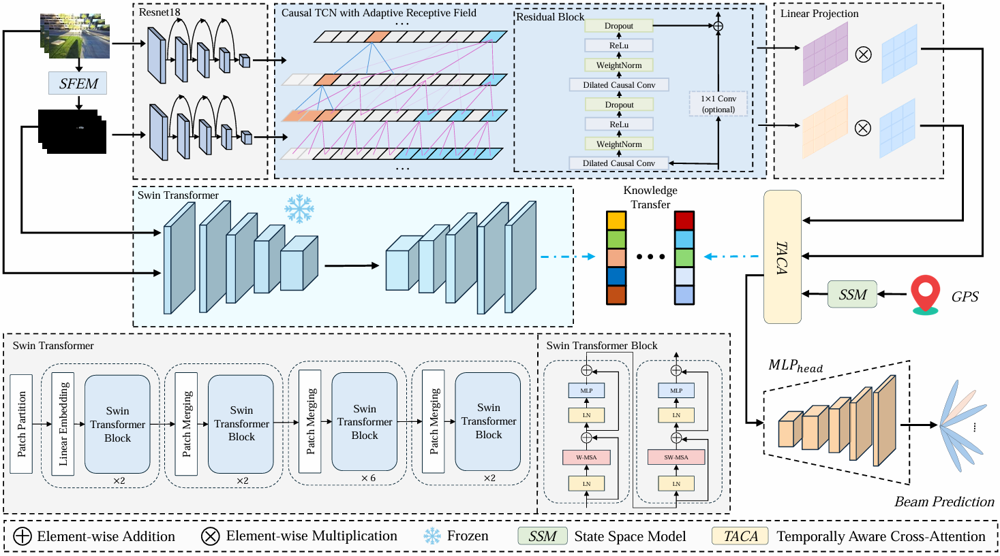
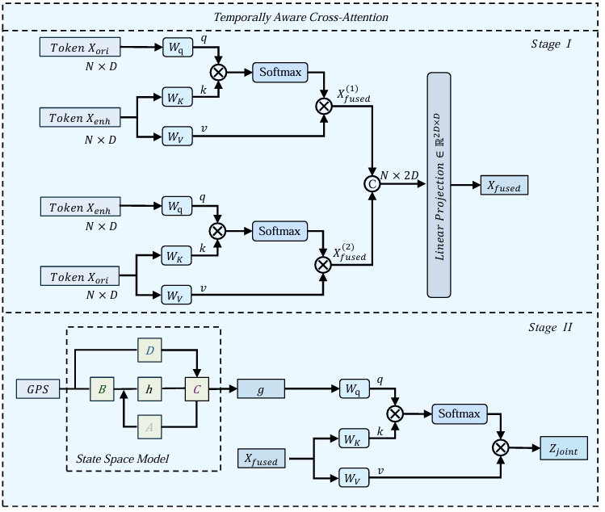
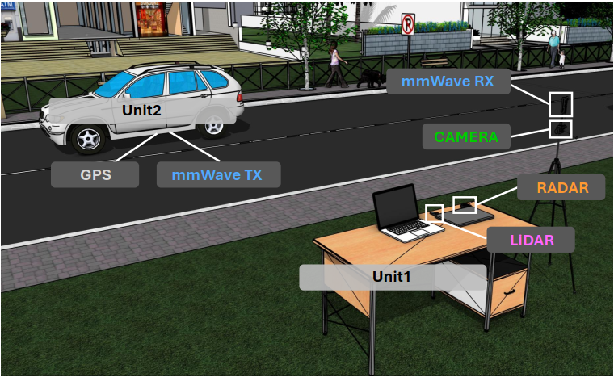
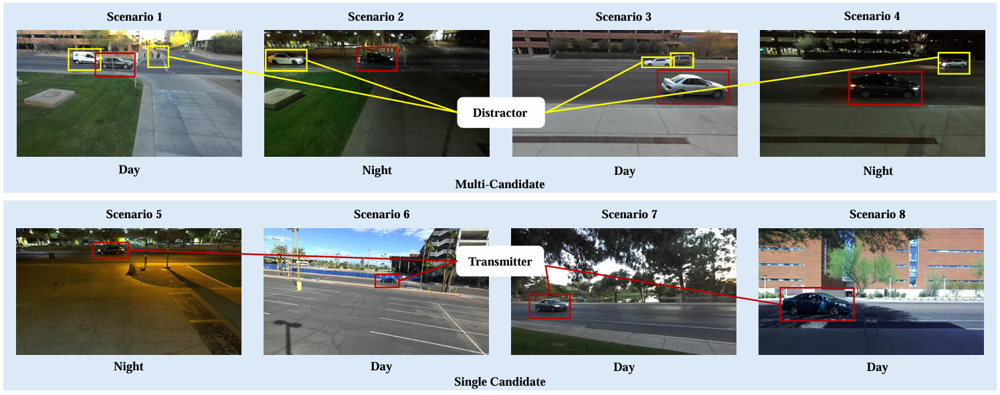
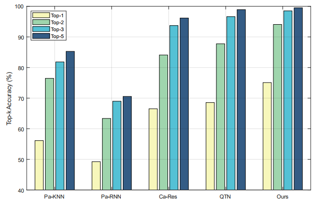
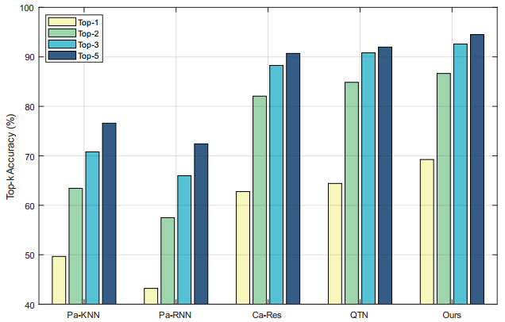
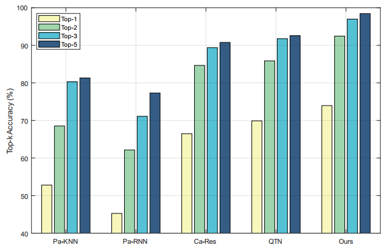
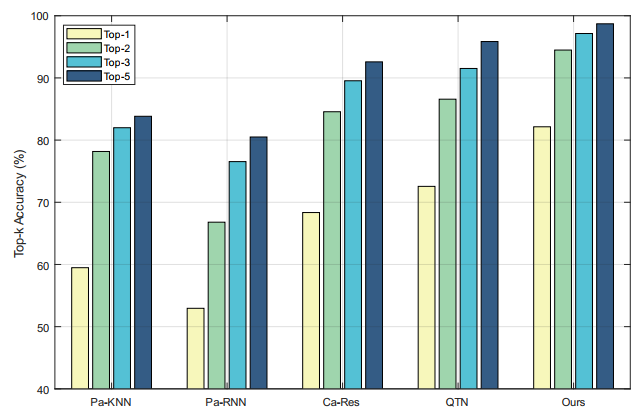
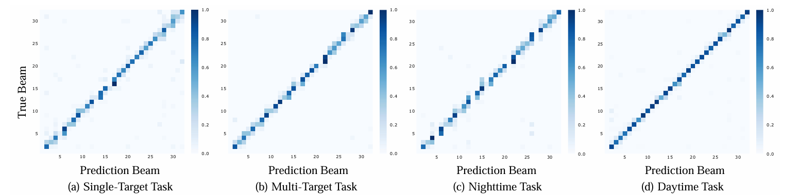
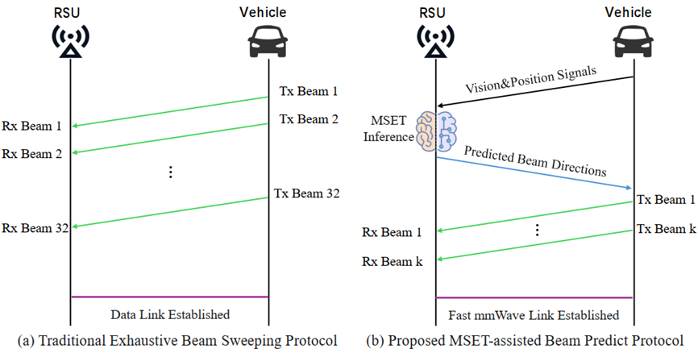

# MSET: Multimodal Semantic-Enhanced Real-World Beam Prediction via Temporal Modeling with Visual Foundation Models

---

### Framework Architecture

MSET is a lightweight, efficient multimodal beam prediction framework tailored for real-world scenarios. It combines visual semantics, temporal modeling, and positional priors to achieve robust performance in complex and dynamic V2I environments.

   
  <em>Figure: Overview of the proposed MSET framework.</em>

   
  <em>Figure: The TACA fusion module.</em>

---

### Setup

Experiments are conducted on the DeepSense 6G dataset.

| Experimental Setup | Dataset Scenarios |
| :---: | :---: |
|  |  |
| *Figure: Data collection platform.* | *Figure: Sample V2I scenarios.* |

---

## Experimental Results

### Task-Specific Performance

The model shows state-of-the-art performance when scenarios are grouped into more challenging, specific tasks.

| Single-Target Task | Multi-Target Task |
| :---: | :---: |
|  |  |
| *Figure: Top-k accuracy (Scenarios 5-8).* | *Figure: Top-k accuracy (Scenarios 1-4).* |

| Nighttime Task | Daytime Task |
| :---: | :---: |
|  |  |
| *Figure: Top-k accuracy (Scenarios 2, 4, 5).* | *Figure: Top-k accuracy (Scenarios 1, 3, 6, 7, 8).* |

### Error Analysis

Confusion matrices show that prediction errors are overwhelmingly concentrated on beams adjacent to the ground truth, indicating high reliability.

*Figure: Row-normalized confusion matrices for beam prediction across the four tasks.*

### Protocol

We embed MSET into the 5G-Advanced beam management procedure. At each decision step, MSET predicts class probabilities and outputs a ranked Top-K list of candidate beams. The base station then probes only these K beams instead of sweeping the entire beam codebook.

   
  <em>*Figure: MSET-Assisted Beam Search and Tracking Protocol.*</em>

---

